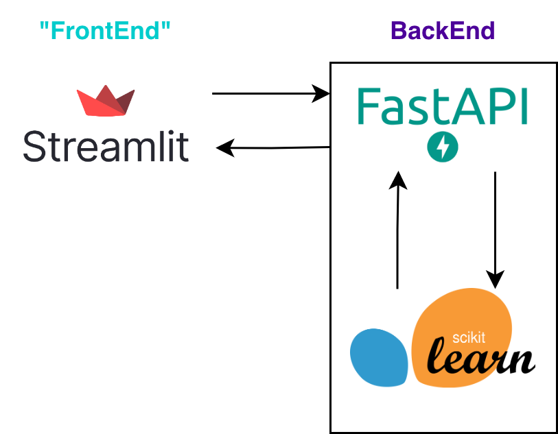

# DsHub Projeto 1: Sistema de Machine Learning para Otimização de Marketing

## Contexto do Problema:
Você é um Engenheiro de ML/Cientista de Dados de uma grande loja. Essa loja está planejando uma grande liquidação de fim de ano. Eles querem lançar uma nova oferta - a adesão Gold, que dá um desconto de 20% em todas as compras, por apenas R$499, enquanto normalmente custaria R$999. A oferta será válida apenas para clientes existentes e uma campanha de ligação telefônica está sendo planejada para eles. A administração acredita que a melhor maneira de **reduzir o custo da campanha é criar um modelo preditivo que classifique os clientes que possivelmente irão adquirir a oferta.**

## Objetivo da Solução:
A superloja deseja prever a probabilidade de um cliente fornecer uma resposta positiva e identificar os diferentes fatores que afetam a resposta do cliente. Você precisa analisar os dados fornecidos para identificar esses fatores e, em seguida, criar um modelo de previsão para prever a probabilidade de um cliente dar uma resposta positiva.

## Dataset:
Os dados passados para o setor de dados foram adiquiridos na campanha do ano passado. Com esses dados devemos predizer os possíveis compradores do plano para este ano.

## Solução:
Para este problema, vamos desenvolver uma solução simples, os passos são:
1. Vamos desenvolver um modelo de ML para gerar predições;
2. Vamos criar uma API utilizando FastAPI para gerar predições para serem mostrados no nosso "frontend";
3. Utilizar o StreamLit para fazer um "frontend" simples onde vamos permitir o upload de um arquivo CSV com os dados a serem preditos;

